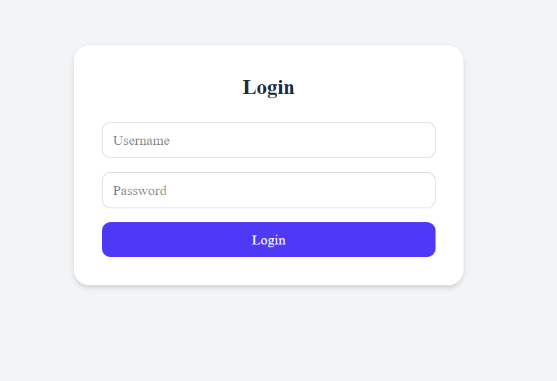
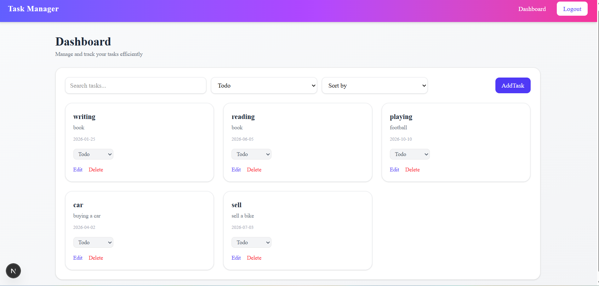
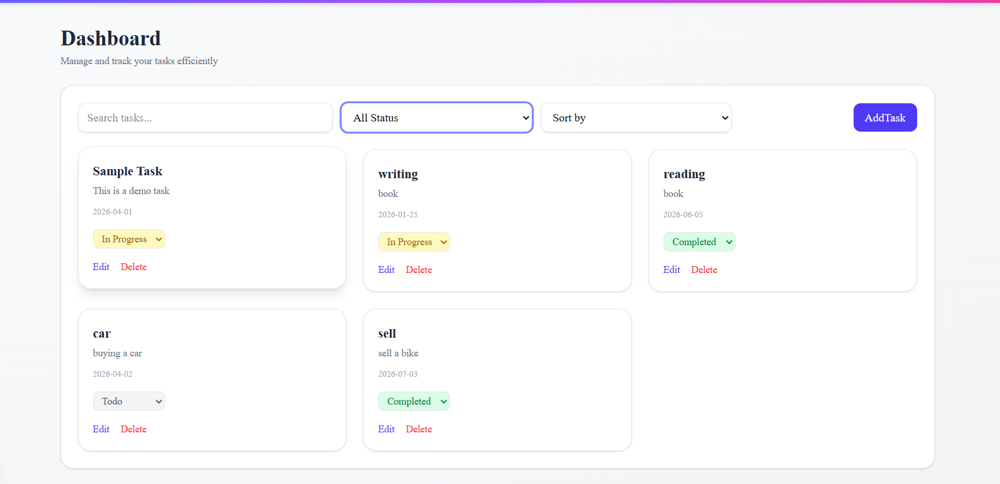

# Task Management App

A simple and efficient **Task Management application** built with **Next.js**. This app allows users to create, update, filter, search, and sort tasks in a clean and intuitive interface.

---

## Table of Contents

- [Project Overview](#project-overview)
- [Features](#features)
- [Screenshots](#screenshots)
- [Installation](#installation)
- [Usage](#usage)
- [Technologies Used](#technologies-used)
- [Contributing](#contributing)
- [License](#license)

---

## Project Overview

The Task Management App helps users manage their tasks efficiently. Users can:

- Add new tasks
- Edit existing tasks
- Filter tasks based on status
- Search tasks by name
- Sort tasks by date

The app is designed to be user-friendly and responsive.

---

## Features

1. **Login Authentication** – Simple Auth
2. **Add Task** – Create new tasks with description.
3. **Edit Task** – Update task information.
4. **Filter Tasks** – View tasks by status: Todo, In Progress, Completed.
5. **Search Tasks** – Quickly find tasks by name.
6. **Sort Tasks** – Organize tasks by newest or oldest.
7. **Dashboard** – Overview of all tasks in one place.

---

## Screenshots

### Login Page

### Dashboard

### Add Task

### Edit Task

### Filters

### Filter by Todo

### Filter by In Progress

### Filter by Completed

### Search by Name

### Sort by Newest

### Sort by Oldest

---

## Installation

1. Clone the repository:

git clone https://github.com/MuhammedHashimvp/task_managment

# Navigate to the project folder
cd task_managment

# Install dependencies
npm install

# Run the development server
npm run dev

# Open your browser at:
http://localhost:3000

---

## Usage

1. Login with simple auth ( username : admin , password : admin@123 ) 
2. Navigate to the dashboard to view tasks.
3. Add a new task using the "Add Task" button.
4. Edit any task by clicking the "Edit" icon.
5. Use filters to view tasks by status.
6. Search tasks by name using the search bar.
7. Sort tasks by newest or oldest.

---

## Technologies Used

- Next.js
- React
- TypeScript
- SessionStorage (for authentication state)
- Shadecn/ui
- TailWind CSS

---

